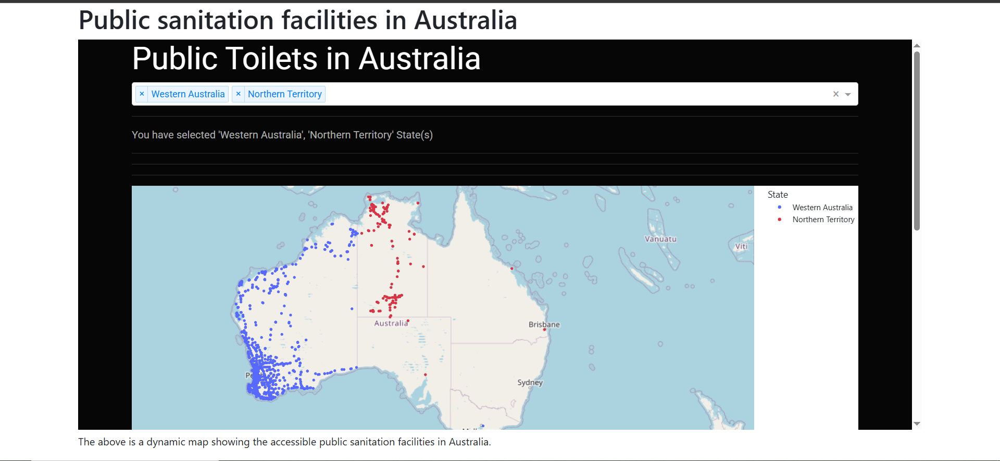

# Chapter 7 

## What is Dash?

Dash is a low-code framework for building data visualization apps using Python. When combined with [Render](https://render.com/), a web-hosting platform, you have a strong combination of hosting your dash app to the global web.


## Rendering dash app in our django app

Truth be told, we tried all we could to render a Dash app inside our Django `sanitation` app using the steps outlined in this [document](https://www.etemkeskin.com/index.php/2020/11/08/how-is-dash-plotly-data-visualization-framework-used-in-django/?utm_source=pocket_shared) and [here](https://www.etemkeskin.com/index.php/2020/11/08/how-is-dash-plotly-data-visualization-framework-used-in-django/?utm_source=pocket_shared). However, we kept running into several errors until we threw in the towel and well, resorted to easier means. 

The below may sound a low-class method but somehow enabled us to achieve the same end with extra space for more creativity if we so wished. HTML provides an `iframe` tag that enables one host a mini-webpage with the same webpage. The syntax is:

```
<iframe src="URL"></iframe>
```

Therefore, going back to the `sanitation.html` file within our `australia` folder, like so, we shall add a `div` tag and some text to give some context to our dashboard.

```
templates
└── australia
    ├── sanitation.html
    └── home.html

```

First let's get the link to our Dash app deployed in render. Here is the [link](https://public-toilets-in-australia-infomap.onrender.com/). 

Previously, you `sanitation.html` template was as follows:

```




    <h1>Sanitation</h1>



```


Add the following `div` element inside your `sanitation.html` template. 

```

<div>
    <iframe src="https://public-toilets-in-australia-infomap.onrender.com" 
    width="100%" height="600px">

    </iframe>
</div>
```

As you can see apart from inserting the url to our Dash app, we also specify the height and width of our webpage. 

For more context, we changed the `<h1>` tag and added a very short paragraph to provide more contextual basis. Showing more on HTML is beyond the scope of this tutorial. Here is the `sanitation.html` template at length.

```




<h1>Public sanitation facilities in Australia</h1>

<div>
    <iframe src="https://public-toilets-in-australia-infomap.onrender.com" 
    width="100%" height="600px">

    </iframe>
</div>

<div>
    <p>The above is a dynamic map showing the accessible 
        public sanitation facilities in Australia.
    </p>
</div>



```

## The Dash app rendered in our Django app

To display the Dash app in our Django app, first ensure that your virtual environment is already activated via `source venv/bin/activate`. Thereafter, run `python3 manage.py runserver` and go to `http://127.0.0.1:8000/sanitation`. If all is well, it will display the webpage shown below.





