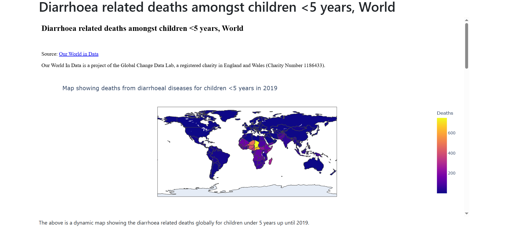

# Chapter 8

## Adding another app 

Now that we had practice with creating our `australia` app that shows the public sanitation facilities in Australia, and even rendered a mini-webpage of our Dash app in it, let's create a second app to concretize our Django skills.

The app we shall create shall render another Dash app of our children diarrhoea related cases. Don't worry about the fanaticism with sanitation issues, it's just that the topic is close to our heart. 

## Create the app in Django 

We want to create an app called `world` that shows diarrhoea related deaths among children. 

The process of creating an app in Django is simple, simply add the name to your app in the command `python manage.py startapp <your-app-name>`. For our `world` app, it will be: 

```
python3 manage.py startapp world
```

This will create a folder called `world` with the following directories:

```
world
├── apps.py
├── views.py
├── migrations
│   └── __init__.py
├── __init__.py
├── admin.py
├── tests.py
└── models.py
```

Let's have a refresher of what each file does:

* `__init__.py` - tells Python to treat the directory as a Python package.

* `admin.py` - contains settings for the Django admin pages.

* `apps.py` - contains settings for the application configuration.

* `models.py` - contains a series of classes that Django’s ORM converts to database tables.

* `tests.py` - contains test classes.

* `views.py` - contains functions and classes that handle what data is displayed in the HTML templates.


## Install the app in your project 

Now let's install the app within our `sanitation` project. Go to the `settings.py` file under the `sanitation` directory. 

Add the following up to the `INSTALLED_APPS` key.

```
INSTALLED_APPS = [
    # my apps
    'australia.apps.AustraliaConfig',
    'world.apps.WorldConfig',
    
    'django.contrib.admin',
    'django.contrib.auth',
    'django.contrib.contenttypes',
    'django.contrib.sessions',
    'django.contrib.messages',
    'django.contrib.staticfiles',
]
```

By doing this, we make the Django configuration know that an app called `world` exists. 

The next step is to create a view to display some content on this app's webpage.

## Create a view 

A view in Django is a collection of functions or classes inside the `views.py` file in an app's directory. Each function or class handles the logic that the app processes each time the user visits a different URL.

Navigate to the `views.py` file in the `world` directory and add the following code:

```
# Create your views here.
def dysentry(request):
    return render(request, "world/dysentry.html", {})
```

In this piece of code, you define a view function named `dysentry()`. When you call this function, it’ll render an HTML file named `dysentry.html`. 

A view function takes at least one argument, `request`. The `request` object is created whenever a page loads, and it contains metadata about the page request.

Now that you’ve created the view function, you need to create the HTML template to display to the user. The `render()` function looks for HTML templates inside a directory called `templates/` in your app directory. Since templates of different apps can have the same names, it’s also best practice to add a subdirectory with the app’s name inside the `templates/` directory.

Create the `template/` directory, a subdirectory named `world/`, and subsequently a file named `dysentry.html` inside it:

## Content for the webpage

Open the `dysentry.html` file. Since we already created a base template and even have a skeleton of our `australia` app, we shall copy everything from the `sanitation.html` file save for the title name and the url in the `iframe` tag.

```




<h1>Diarrhoea related deaths amongst children <5 years, World</h1>

<div>
    <iframe src="https://data-visualization-for-diarrhoea-deaths.onrender.com/" 
    width="100%" height="600px">

    </iframe>
</div>

<div>
    <p>The above is a dynamic map showing the diarrhoea 
        related deaths globally for children under 5 years up until 2019.
    </p>
</div>



```

Now that you’ve created the template that your `dysentry` view function expects, you need to tell Django when to serve the view. For this, you need to create a new route to the project.


## Add a route 

Next, you need to hook up an URL so that you can visit the page that you’ve just created. Your `sanitation/` folder contains a file named `urls.py`. In this file, you’ll include a URL configuration for the `world` app:

By adding another `path()` to `urlpatterns`, you create a new route for your Django `sanitation` project. Whenever you visit the root path of your project, the routes of the pages application will load. The `world.urls` module doesn’t exist yet, so you’ll need to create it by adding a `urls.py` file under the `world` directory.

```
world
├── apps.py
├── templates
│   └── world
│       └── dysentry.html
├── views.py
├── migrations
│   └── __init__.py
├── __init__.py
├── urls.py
├── admin.py
├── tests.py
└── models.py
```

Inside the `world/urls.py` file, add the following:

```
from django.urls import path  
from world import views 

urlpatterns = [
    path("dysentry", views.dysentry, name="dysentry"),
]

```

We define a list of URL patterns that correspond to the various view function, in our case, the `dysentry` view function. That's what we include here.

## View the app

To view our app, run `python3 manage.py runserver`.




