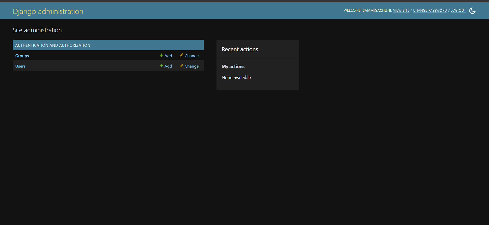
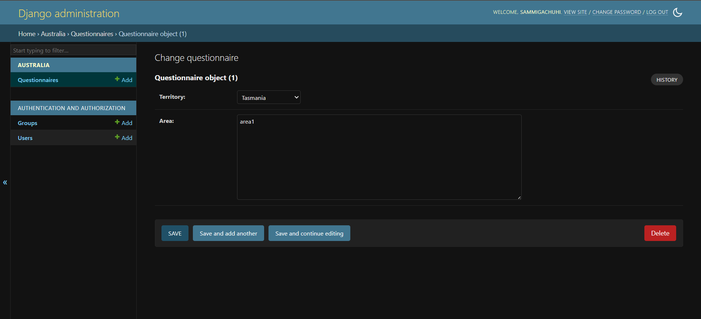

# Chapter 10 

## What is the Django admin?

Right after creating your models, creating the Django admin is the next step. But before we jump ahead of the gun, what exactly is Django Admin? 

[Django admin](https://developer.mozilla.org/en-US/docs/Learn_web_development/Extensions/Server-side/Django/Admin_site) is an interface that allows developers to manage their projects: that is create, view, update and remove records from their applications. The Django Admin tool is very useful in that it can be the best playground to test whether your models are collecting the right data. Although it is effective on this, a caveat here, it is not the best tool to use if your intend to grow the customer base of your app. Not many people will appreciate this interface and it is recommended to integrate another one. 

## Create super user

As the creator of your project, and you want to take a step further and test out your models, you will need to have a *super* account. This is an account that has access to all sites and permissions. 

To create your superuser account, go to your project level and type:

```
python3 manage.py createsuperuser
```

You will be prompted to enter a username, email and a password. At the password bit, don't panic if you can't see what you're typing. It is by design. Just ensure you have a password you can both remember and is secure. 

```

Username (leave blank to use 'sammigachuhi'): <your-username>
Email address: <optional-email-address>
Password: 
Password (again): 
Superuser created successfully.
```

Once you add yourself as the superuser, Django will add your credentials to the database as well.

## Test login

To check whether you've been able to successfully create a superuser, restart the server.

Of course the serve will by default route to this url: `http://127.0.0.1:8000/`. However, add `admin` at the end so that it is: `http://127.0.0.1:8000/admin`. 

Django will take you to a login page like below. 


Now login using the credentials you provided when creating the superuser account. 

You will be taken to a new site like below.



If you click on the **Users** link, it will open a new interface which shows the users who currently have access to the Django admin site. You as the superuser are currently the first one. 


If you add other more users into the Django admin site, their credentials will also appear here.

However, we can't see the models of our `sanitation` project anywhere. 

Let's add it.

First, go to your `australia/admin.py` file.

Then import the model(s) you created. We use `.models` because we are importing from the `models.py` which is in the same folder thus the use of the dot (.) before.

```
from django.contrib import admin
from .models import Questionnaire

```

Register your model. 

```
# Register your models here.
class QuestionnaireAdmin(admin.ModelAdmin):
    pass 

admin.site.register(Questionnaire, QuestionnaireAdmin)

```

The `admin.site.register()` function registers our models in the Django Admin interface from whence we can perform our *Create, Update and Delete (CRUD)* functions.

The ModelAdmin class, where ours is `QuestionnaireAdmin` will be a representation of our model in the Django Admin interface. If you refresh your browser, you will see our **Questionnaire** model appear under the name of our application --`Australia`. 


If you click on the **Questionnaire** model, you will see a list of our the two Questionnaires we created earlier in Django shell. 


If you click on one of them, you will see the responses that we put in via Django shell. However, curiously, our `survey_date` and `survey_time` responses are missing. 




