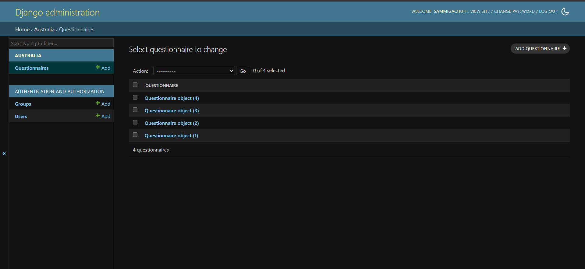
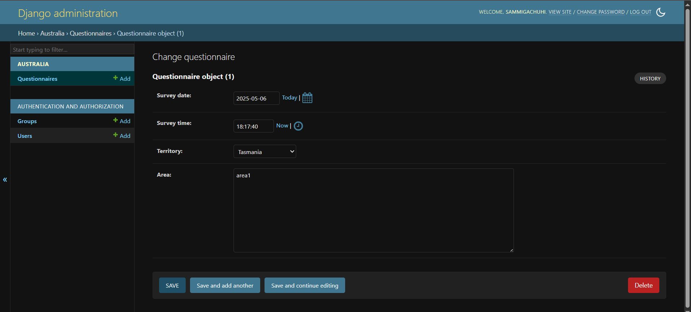
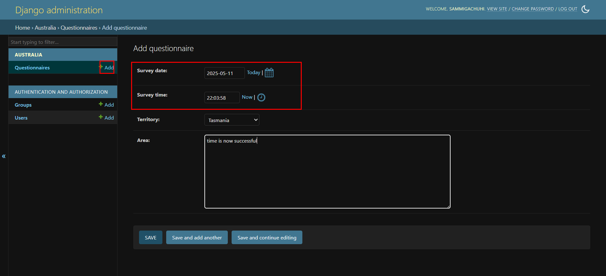

# Chapter 11 

## Missing date and time fields

From the last chapter, we had a function Django admin site that shows our model's fields except for `survey_date` and `survey_time`. Apparently, if one uses the `auto_add_new` parameter in their `DateTime` and `TimeField` fields, or even `DateTimeField` for that matter, the date and time fields will be automatically added when the object is created for the first time. They will also be uneditable. However, they will not appear in the Django Admin.

What shall we do yet the date and time is important to know when the survey was being conducted?

## Date and time fields in Django Admin 

There is a work around to the above problem. We will make the date and time fields (unfortunately) editable but they will be set at the current date and time by default. 

In your `australia/models.py`, change the `survey_date` and `survey_time` fields to match as below:

```
from datetime import date
from django.utils import timezone

--snip-- 
survey_date = models.DateField(default=date.today)

survey_time = models.TimeField(default=timezone.localtime)

--snip--
```

This sets the `survey_date` to use the current date and for the `survey_time` to use the current time at our local timezone. 

Let's define our timezone in `settings.py`.

```
TIME_ZONE = 'Africa/Nairobi'

```

Feel free to use your local timezone as contained in this list of [timezones](https://en.wikipedia.org/wiki/List_of_tz_database_time_zones).

## Modify the `admin.py`

In our first instance of creating models, we simply used `pass` keyword to capture all fields defined by our `QuestionnaireAdmin` class.

```
class QuestionnaireAdmin(admin.ModelAdmin):
    pass 

```

How about if you want to arrange the order in which your model fields appear in Django Admin? 

You can do so by creating a list under your `ModelAdmin`, in this case `QuestionnaireAdmin` like below.

```
class QuestionnaireAdmin(admin.ModelAdmin):
    # pass 
    fields = ("survey_date", "survey_time", "territory", "area",)

```

This will display the fields in our DjangoAdmin as `survey_date`, `survey_time`, `territory`, and `area` in that order.

## Migrate the model

Now that we've made changes to our model, it's time we tell Django to make updates to our database schema.

First run `python3 manage.py makemigrations australia` to tell Django to make records of the updates but limited to the `australia` application only.

```
Migrations for 'australia':
  australia/migrations/0007_alter_questionnaire_survey_time.py
    ~ Alter field survey_time on questionnaire
```

Thereafter, run `python3 manage.py migrate australia` to tell Django to apply the modifications in our database schema, and only for those updates within the `australia` app. 

```
Operations to perform:
  Apply all migrations: australia
Running migrations:
  Applying australia.0007_alter_questionnaire_survey_time... OK
```

Once done, run `python3 manage.py runserver`. Go to `http://127.0.0.1:8000/admin`. 

Go to the **Questionnaire** button under your **Australia** application name.

click on any previous response, say *Questionnaire object (1)*. 



Click on it. You will see the date and time at which the question was set. This is because according to the [Django documentation](https://docs.djangoproject.com/en/5.2/ref/models/fields/#datefield), the `auto_add_now` parameter sets the date and time to when the object was first created.





If you add a question, you will notice that the `survey_date` as *Survey date* and `survey_time` as *Survey time* appear and are by default set to your local time, all thanks to the `TIME_ZONE` we defined and updates we made in the `australia/models.py` file.

You canl leave the date and time fields at their defaults or change them.



If you hit **SAVE** the question will be saved with the date and time you've specified.
