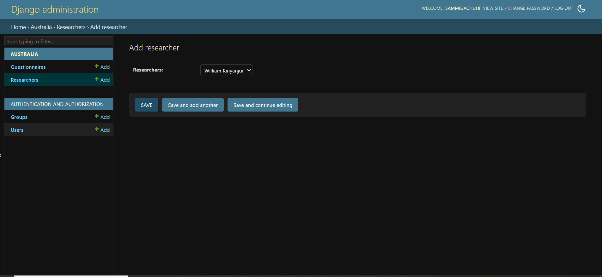

# Chapter 12 

## Foreign keys

A [foreign key](https://www.freecodecamp.org/news/how-to-use-a-foreign-key-in-django/) in Django is a field in your table that is used to link two tables together. Think of it as a field that enables a *many-to-one* relationship where a single author can have multiple books, a single customer can shop various items and a single blog can have many comments. A foreign key is what will be used to link a single row to several records or even the reverse. 

We already have a model that collects basic information: `survey_date`, `survey_time`, `territory`, and `area`. We would like to go a step further. The original idea was to create a dynamic choices list where we would have multiple-select question with a dropdown of the field team's names and a second follow-up question which would be single-select and based on the choices selected from the former. However, that proved tricky as shown [here](https://stackoverflow.com/questions/24431827/django-model-choice-field-depend-on-other-fields-choice). Nevertheless, we proceeded with the idea of Foreign keys as it is an important topic in Django.

## Modify the models

In our `models.py` file, we would like to create the model that will be used to select all the team members that were part of the entourage of interviewing people. 

Let's do so:

```
from django.db import models
from datetime import date
from django.utils import timezone

# Create your models here.
class Researcher(models.Model):

    RESEARCHERS_LIST = {
        "Bwana_Waziri": "Bwana Waziri",
        "Samuel_Gachuhi": "Samuel Gachuhi",
        "Jane_Otieno": "Jane Otieno",
        "Janet_Awino": "Janet Awino",
        "William_Kinyanjui": "William Kinyanjui",
        "Johnson_Ngugi": "Johnson Ngugi"
    }

    researchers = models.CharField(choices=RESEARCHERS_LIST, default="Bwana_Waziri")

    def __str__(self):
        return self.researchers
```


In the above, we define a dictionary called `RESEARCHERS_LIST` that will contain the names our field members. 

We also pass a `def __str__(self)`. This function is used to return the name of the value to be rendered on the admin, and not something like `Researcher object (1)` as shown below. Omitting this field will make Django return the object number which is not helpful at all.


For the **Questionnaire** model, we add the following lines:

```
recorder = models.ForeignKey(Researcher, on_delete=models.CASCADE,)

    def __str__(self):
        return f"Date: {self.survey_date} Recorder: {self.recorder}"
```

The above does the following:

1. The `recorder` variable is a ForeignKey object. The `models.ForeignKey` takes at least two parameters: the model to reference to and the `on_delete` option. Here, we define the reference model as `Researcher` and the `on_delete` as `models.CASCADE`. On the latter, this means that if the parent object, in this case the name of the recorder, this will affect the row in the `Questionnaire` model as well.

We also define a `def __string__(self)` here which will show on the Django admin webpage the date at which the questionnaire was filled and the recorder.

## Register models

Since we had a created a new `Researcher` model, we will have to add it to the `admin.py` page. The `admin.py` is used to display our models in the Django website. 

Let's add our `Researcher` model in the `admin.py` file. Notice that we first call it before registering, otherwise Django won't know it is there. Or in simple terms you will face errors.

```
from django.contrib import admin
from .models import Researcher
from .models import Questionnaire
```

Now let's add the `Researcher` model.

```
class ResearchersAdmin(admin.ModelAdmin):

    fields = ("researchers",)

```

Now let's finally register the model.

```
admin.site.register(Researcher, ResearchersAdmin)
```

## Migrate

To keep a record of all the changes we've made to our models, run:

```
python3 manage.py makemigrations australia
```


The last part, `australia` species we will only make migrations to the model(s) in our `australia` app.

Then let implement the changes in the database:

```
python3 manage.py  migrate australia
```

You will see a new message related to updating missing fields. Just go with the first option of `1)` in all cases. 

Thereafter, run `python3 manage.py runserver`. Go to the localhost `http://127.0.0.1:8000/admin` for all matters admin.

The interface should be self-explanatory. Add a `Researcher` variable 
by using the buttons with the `+` sign.


Once you've added another researcher from the dropdown, hit `SAVE`.



Add a couple of more recorders.

Create a new Questionnaire by clicking the button with **ADD QUESTIONNAIRE +**. 

The previous questions of *Survey date*, *Survey time*, *Territory* and *Area* will be there. But you will also see the `Recorder` dropdown which upon clicking will display the names of all the added `Researchers`. 


Select one of the researchers from the dropdown and hit **SAVE**. 


The result will be the record will be saved and displayed on the **Questionnaires** webpage.


