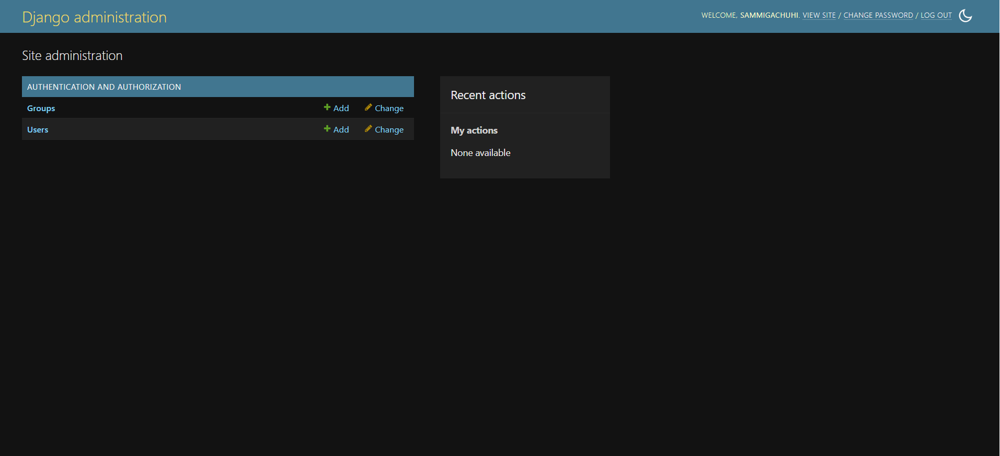

# Chapter 17

## Prerequisites for geodjango
To work with Geodjango, you will first have to install Postgresql and PostGIS.

[Postgresql](https://www.enterprisedb.com/postgres-tutorials/why-django-so-impressive-developing-postgresql-and-python?lang=en) is the world's most powerful object-oriented database. The number one reason for us to use Postgresql is because Geodjango will only work with Postgresql, and not spatial lite. Other than that, Postgresql is the preferred database when working with large projects where the number of your app users is far much bigger than just a few tens. 


[PostGIS](https://postgis.net/) extends the capabilities of the PostgreSQL relational database by adding support for storing, indexing, and querying geospatial data. PostGIS features include:

* `Spatial Data Storage`: Store different types of spatial data such as points, lines, polygons, and multi-geometries, in both 2D and 3D data.

* `Spatial Indexing`: Quickly search and retrieve spatial data based on its location.

* `Spatial Functions`: A wide range of spatial functions that allow you to filter and analyze spatial data, measuring distances and areas, intersecting geometries, buffering, and more.

* `Geometry Processing`: Tools for processing and manipulating geometry data, such as simplification, conversion, and generalization.

* `Raster Data Support`: Storage and processing of raster data, such as elevation data and weather data.

* `Geocoding and Reverse Geocoding`: Functions for geocoding and reverse geocoding.

* `Integration`: Access and work with PostGIS using third party tools such as QGIS, GeoServer, MapServer, ArcGIS, Tableau.


## Installing Postgresql 

We will follow the steps from the [Digital Ocean](https://www.digitalocean.com/community/tutorials/how-to-use-postgresql-with-your-django-application-on-ubuntu-22-04) website. 

First let's update our package manager cache by using `apt`:

```
sudo apt update
```

The above code makes sure that the system has sufficient information of about the dependencies of each package. The code does not install any software, it only provides the information of the latest dependencies for each package.

When you run the above code it will provide your system pseudo name and ask for your passord. 

Thereafter, run the following code to install the necessary packages to enable Postgresql run smoothly.

```
sudo apt install python3-pip python3-dev libpq-dev postgresql postgresql-contrib
```

## Creating a database and database user 

During the Postgres installation, an operating system user named `postgres` was created to correspond to the `postgres` PostgreSQL administrative user. You need to use this user `postgres` to perform administrative tasks. Use `sudo` to pass in the username `postgres` along with the `-u` option which runs the command as a user, instead of root. Log into the interactive Postgres session by writing the following:

```
sudo -u postgres psql
```

If you run the above code, a new shell script appears: `postgres=#`...

Now let's create a database and provide a name for it --`my_geodjango`. 

```
CREATE DATABASE my_geodjango;
```

Now let's create a user for this database. 

```
CREATE USER gachuhi WITH PASSWORD '2013';
```

Let's do some modifications that will speed up our database operations.

```
ALTER ROLE gachuhi SET client_encoding TO 'utf8';
```

Let's grant all priviledges to the user `samuel`.

```
GRANT ALL PRIVILEGES ON DATABASE my_geodjango TO gachuhi;
```

As a sanity check to see a list of the existing databases and to confirm the newly created is one of them you can do this via: `\list`.

```
List of databases
     Name     |  Owner   | Encoding | Collate |  Ctype  |     Access privileges     
--------------+----------+----------+---------+---------+---------------------------
 my_django    | postgres | UTF8     | C.UTF-8 | C.UTF-8 | =Tc/postgres             +
              |          |          |         |         | postgres=CTc/postgres    +
              |          |          |         |         | samuel=CTc/postgres
 my_geodjango | postgres | UTF8     | C.UTF-8 | C.UTF-8 | =Tc/postgres             +
              |          |          |         |         | postgres=CTc/postgres    +
              |          |          |         |         | gachuhi=CTc/postgres

--snip--
```

You can now exist the shell session via: `\q`.


## Installing `psycopg2`

This package is used to connect Python to the Postgresql database.

```
pip install Django psycopg2
```


# Configuring our database 

As mentioned earlier, Geodjango will only work with the Postgresql database. And by the way, it is preferable to work with Postgresql for larger projects. 

The default database for any Django project is the sqlite database as shown below.

```
DATABASES = {
    'default': {
        'ENGINE': 'django.db.backends.sqlite3',
        'NAME': BASE_DIR / 'db.sqlite3',
    }
}
```

However, we shall comment out the entire `'default'` dictionary and replace it with the details of our Postgresql database. 

```
DATABASES = {
    # 'default': {
    #     'ENGINE': 'django.db.backends.sqlite3',
    #     'NAME': BASE_DIR / 'db.sqlite3',
    # }

    'default': {
        'ENGINE': 'django.db.backends.postgresql',
        'NAME': 'my_django',
        'USER': 'samuel',
        'PASSWORD': '2013',
        'HOST': 'localhost',
        'PORT': '',
    }
}
```

Replace the entire `DATABASE` variable with the new defaults. You can choose to comment out or completely erase the former `'defaults'` values. I prefer to comment out so that I can easily revert to the originals in case things get tricky!

```
DATABASES = {
    # 'default': {
    #     'ENGINE': 'django.db.backends.sqlite3',
    #     'NAME': BASE_DIR / 'db.sqlite3',
    # }

    'default': {
        'ENGINE': 'django.contrib.gis.db.backends.postgis',
        'NAME': 'my_geodjango',
        'USER': 'gachuhi',
        'PASSWORD': '2013',
        'HOST': 'localhost',
        'PORT': '',
    }
}
```

## Installing PostGIS

To install Postgis, simpy run:

```
sudo apt install postgis
```

You will be prompted for a password.

Let's go back to the Postresql shell again. We want to enable the PostGIS extension for our Django project.

```
sudo -u postgres psql
```

Once the Postgresql shell opens, insert the following:

```
CREATE EXTENSION IF NOT EXISTS postgis;
```

We shall make the user we created, `gachuhi` in this case, as the superuser. Insert the following in the Postgresql shell

```
ALTER ROLE gachuhi SUPERUSER;
```

## Make migrations

To persist our changes to the database, register our migrations and execute them via `python3 manage.py makemigrations` and `python3 manage.py migrate` respectively.

## Creating a superuser

We will create a superuser who will be the admin of our Django-admin platform.

To keep matters simple, we shall use the same credentials as those in our `sanitation/` project.

```
python manage.py createsuperuser
```

You will be prompted for a username, email and password.

```
Username (leave blank to use 'sammigachuhi'): <your-username>
Email address: <your-email>
Password: 
Password (again): 

```

If the response you get after inserting your credentials is `Superuser created successfully.`, then you're good to go.

Run our Geodjango server via `python3 manage.py runserver` and head to `http://127.0.0.1:8000/admin/`. Check if you can sign in using the username and password your provided above. 

If all is well, it should take you to the Django-admin page below.




